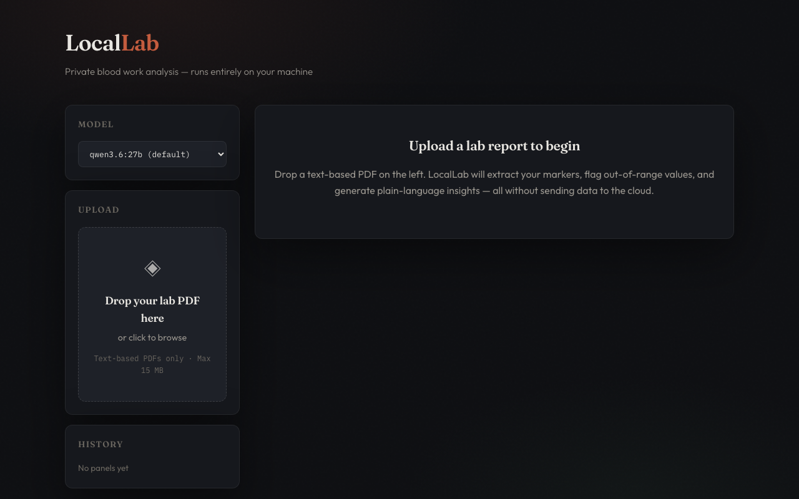

# LocalLab

A privacy-first, fully-local web app for analyzing blood work results. Upload a lab PDF, extract structured markers with a local Ollama LLM, store results in SQLite, and view insights and trends.



## Prerequisites

- [Node.js](https://nodejs.org) 20+
- [Ollama](https://ollama.com) running locally with at least one model pulled (e.g. `ollama pull llama3.2`)

## Setup

```bash
cp .env.example .env
npm install
npm run db:push
```

## Development

```bash
npm run dev
```

- Web UI: http://localhost:5173
- API: http://localhost:3001

## Production

```bash
npm run build
npm start
```

- App: http://localhost:3001 (API and web UI on one port)

## Verify

```bash
npm run verify
```

Runs TypeScript type-checking (`tsc --noEmit`) and unit tests.

## Configuration

| Variable | Default | Description |
|----------|---------|-------------|
| `OLLAMA_URL` | `http://localhost:11434` | Ollama API base URL |
| `OLLAMA_TIMEOUT_MS` | `0` | Idle timeout while streaming Ollama tokens; `0` disables the limit |
| `PORT` | `3001` | Express API port |

Choose a model from the web UI before uploading or generating insights.
