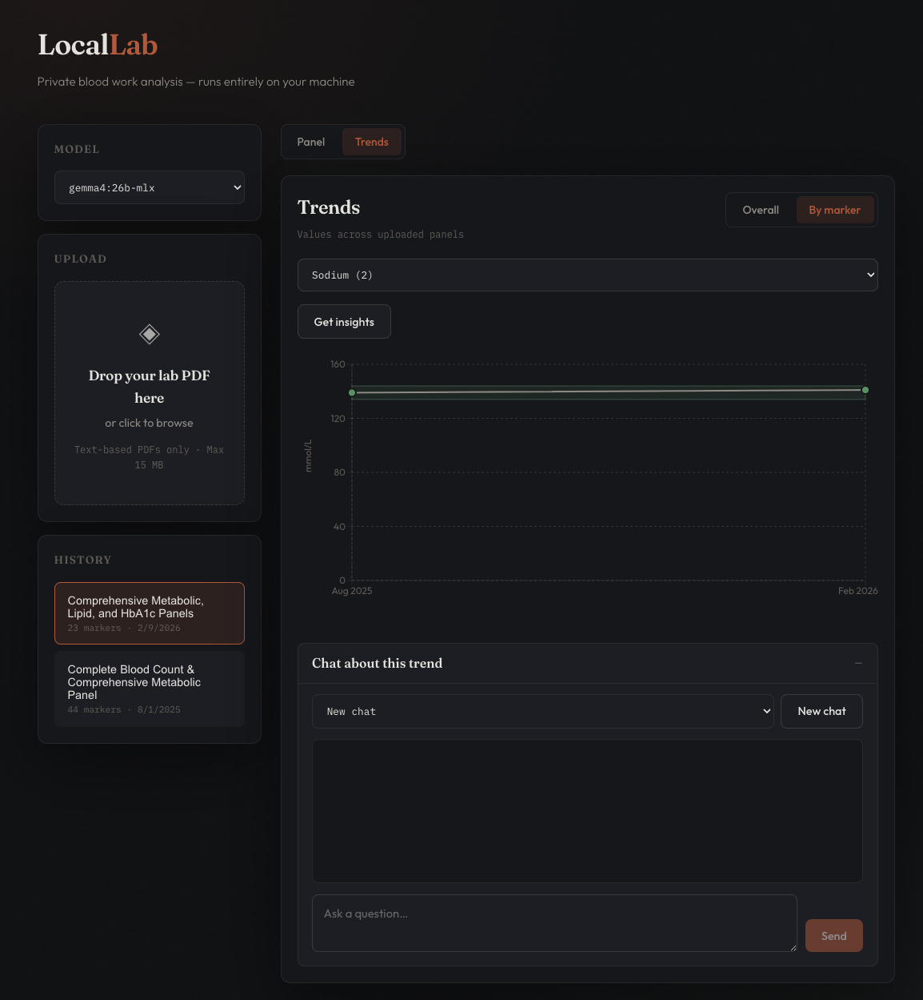

# LocalLab

A privacy-first, fully-local web app for analyzing blood work results. Upload a lab PDF, extract structured markers with a local Ollama LLM, store results in SQLite, and view insights and trends.



## Prerequisites

- [Node.js](https://nodejs.org) 20+
- [Ollama](https://ollama.com) running locally with at least one model pulled (e.g. `ollama pull gemma4:26b`)

## Setup

```bash
cp .env.example .env
npm install
npm run db:push
```

## Database backup

```bash
npm run db:backup
```

Creates a timestamped copy of `data/app.db` under `data/backups/`.

## Development

```bash
npm run dev
```

- Web UI: http://localhost:5173
- API: http://localhost:3001

## Production

```bash
npm run build
npm start
```

- App: http://localhost:3001 (API and web UI on one port)

## Verify

```bash
npm run verify
```

Runs TypeScript type-checking (`tsc --noEmit`) and unit tests (canned graders only — no Ollama calls).

## Live evals

Panel and trend Level 1 live scoring hit your local Ollama model and are **not** part of `npm test` / `npm run verify`. Requires Ollama running and `OLLAMA_MODEL` set (via `.env` or `--model`). Use `--suite panel|trend|all` (default `all`).

```bash
npm run test:live-eval -- --suite panel --model gemma4:26b
npm run test:live-eval -- --suite trend --model gemma4:26b
npm run test:live-eval -- --model qwen3.6:27b --timeout-ms 1200000
```

On failure, the suite logs failing assertion ids and the raw model answer for each case.

### Baselines and model comparisons

- **Baseline** (one model; suite `panel`, `trend`, or `all` → two files): ask Cursor with the `baseline-live-evals` skill, e.g. “baseline trend on gemma4:26b” or “baseline all on gemma4:26b-mlx”. Reports go to `evals/baselines/`.
- **Compare** (same suite, multiple models): ask with `compare-live-evals`, e.g. “compare trend live evals against gemma4:26b and medgemma1.5:latest” (suite defaults to panel if omitted). Reports go to `evals/comparisons/`.

Both report dirs are gitignored by default; force-add only when committing a decision record.

## Configuration

| Variable | Default | Description |
|----------|---------|-------------|
| `OLLAMA_URL` | `http://localhost:11434` | Ollama API base URL |
| `OLLAMA_TIMEOUT_MS` | `0` | Idle timeout while streaming Ollama tokens; `0` disables the limit |
| `OLLAMA_MODEL` | — | Model for live evals (`npm run test:live-eval`); override with `--model` |
| `LOCALLAB_LIVE_EVAL` | `0` | Keep `0` for normal use; `test:live-eval` sets this to `1` |
| `LOCALLAB_LIVE_EVAL_TIMEOUT_MS` | `900000` | Per-case live-eval timeout in ms; override with `--timeout-ms` |
| `PORT` | `3001` | Express API port |

Choose a model from the web UI before uploading or generating insights.
